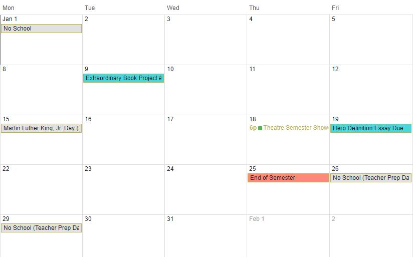

# Ms. Kurfman's ELA 8 Class Website

## Calendar
### January 2018

## Defining a Hero -- Expository Essay Unit
### Additional Heroism Resources
Feel free to quote (choose a sentence or part of a sentence from it, write it in your essay, putting it in quotes) any of the following articles, if they help support your hero definition in your essay. An in-text citation is provided for each, so that you can easily quote with TLC (Transition, lead-in: "Quote" (citation). Since it's a websource, you will not use a page number, but just the author's last name. If we were doing full citations, the last name would lead us to the entry on the works cited page, which would be on its own page after the essay.
* ["What False Quotes Tell Us About Ourselves" (& more about defining our heroes) by Jen Lawrence](https://engagethefox.wordpress.com/2014/11/28/what-false-quotes-tell-us-about-ourselves/) Citation: (Lawrence)
* ["What Makes a Hero?" by Dr. Alex Lickerman](https://www.psychologytoday.com/blog/happiness-in-world/201009/what-makes-hero) Citation: (Lickerman)
* ["What Makes a Hero?" by Barbara McNally](https://www.huffingtonpost.com/barbara-mcnally/what-makes-a-hero_1_b_11836486.html) Citation: (McNally)
* ["What Makes a Hero?" by Philip Zimbardo](https://greatergood.berkeley.edu/article/item/what_makes_a_hero) Citation: (Zimbardo)

##Extraordinary Book Project (Quarterly Assignment)
[Quarter 2 Assignment](https://docs.google.com/document/d/1VZb2BU9Y8cG22COWeGPIGhjR4rVIk957_4kkhOoNWtQ/edit?usp=sharing)
####No Spoilers! 
Make sure your book project does not contain any OBVIOUS spoilers! Subtle ones are okay (like, quotes from the end of the book), but don’t give away the whole plot. Also, you can put spoilers in something obviously intended for the teacher only (aka, a summary on the back).
####GOALs: 
* To intrigue others about your book by presenting enough information in an interesting enough way that other students can determine whether or not they want to read it. :)
* To explore your book more deeply and think about it further by creating this unique project.
####Rubric
