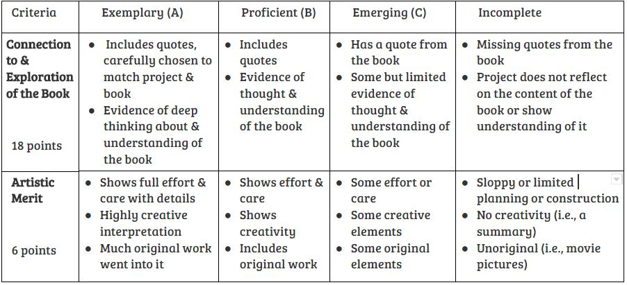

# Ms. Kurfman's ELA 8 Class Website

## Calendar
### January 2018

## Defining a Hero -- Expository Essay Unit
### [Prompt & Rubric](HeroDefinitionEssayAssignment.pdf)

### Additional Heroism Resources
Feel free to quote (choose a sentence or part of a sentence from it, write it in your essay, putting it in quotes) any of the following articles, if they help support your hero definition in your essay. An in-text citation is provided for each, so that you can easily quote with TLC (Transition, lead-in: "Quote" (citation). Since it's a websource, you will not use a page number, but just the author's last name. If we were doing full citations, the last name would lead us to the entry on the works cited page, which would be on its own page after the essay.
* ["What False Quotes Tell Us About Ourselves" (& more about defining our heroes) by Jen Lawrence](https://engagethefox.wordpress.com/2014/11/28/what-false-quotes-tell-us-about-ourselves/) Citation: (Lawrence)
* ["What Makes a Hero?" by Dr. Alex Lickerman](https://www.psychologytoday.com/blog/happiness-in-world/201009/what-makes-hero) Citation: (Lickerman)
* ["What Makes a Hero?" by Barbara McNally](https://www.huffingtonpost.com/barbara-mcnally/what-makes-a-hero_1_b_11836486.html) Citation: (McNally)
* ["What Makes a Hero?" by Philip Zimbardo](https://greatergood.berkeley.edu/article/item/what_makes_a_hero) Citation: (Zimbardo)

## Extraordinary Book Project (Quarterly Assignment)
[Quarter 2 Assignment](https://docs.google.com/document/d/1VZb2BU9Y8cG22COWeGPIGhjR4rVIk957_4kkhOoNWtQ/edit?usp=sharing)

#### No Spoilers! 
Make sure your book project does not contain any OBVIOUS spoilers! Subtle ones are okay (like, quotes from the end of the book), but don’t give away the whole plot. Also, you can put spoilers in something obviously intended for the teacher only (aka, a summary on the back).

#### Goals: 
* To intrigue others about your book by presenting enough information in an interesting enough way that other students can determine whether or not they want to read it. :)
* To explore your book more deeply and think about it further by creating this unique project.

#### Rubric

### Menu of Options
1. Make a Book Trailer (must know technology)
    * It’s a video advertisement for the book -- acted out or illustrated.
    * Can be slideshow style, with music, or an in-motion video.
2. Found Poetry
    * Use words from your book (phrases, single words) to craft a poem.
    * It doesn’t have to rhyme.
    * It does have to tell the story of a character or of part of the plot.
3. Social Media
    * Create a paper or actual Snapchat or Instagram (or, etc.) for a character in your story or for multiple characters.
    * Show them interacting with one another and/or show the interests and ideas of one character.
    * Turn in Snapchat/Instagram with screenshots, or turn in the paper version.
4. Collages
    * Digital or physical collage of important images, words, and quotes.
    * Whole book? Just one character? Either or a combination works.
    * Make sure to create a UNIQUE arrangement of quotes, words, and images.
5. A “Mix-Tape” / Playlist
    * Create a playlist for the book as a whole or for a character.
    * What would the characters listen to? Or, what would the mood music be to score several important scenes?
    * Turn in the music along with a write up to include the quotes (or add in some original piece with quotes?).
6. Yearbook
    * What would your character be a part of? Who would sign their yearbook?
    * For this one, create a single spread or single yearbook page.
    * Include at least one picture and several messages from other characters.
7. Cast the Film
    * Explain who should play the main characters and why -- what kind of acting skill is required for this role?
    * If it has already been turned into a movie, what do you think of the casting? Good or bad? Why or why not?
    * Could combine visuals with writing, easiest electronically.
8. Fan-Fiction
    * Write a story of your own that is inspired by the book.
    * This could be a sequel, a deleted scene, or a re-written scene.
    * It also could tell more of the story of a minor character.
9. Other extraordinary book project ideas? Get it approved! :) Some previously approved projects:
    * Original poem instead of found poem
    * Skit
    * Rap
